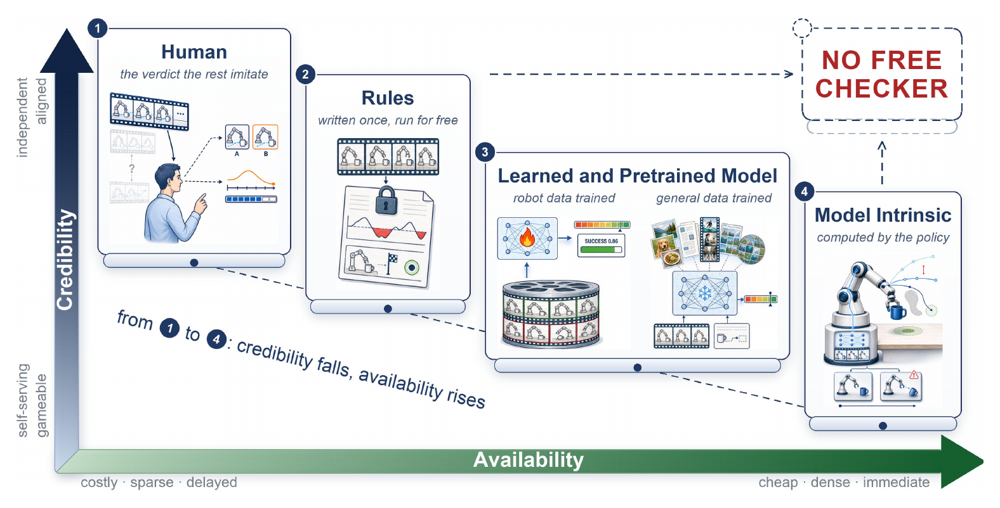
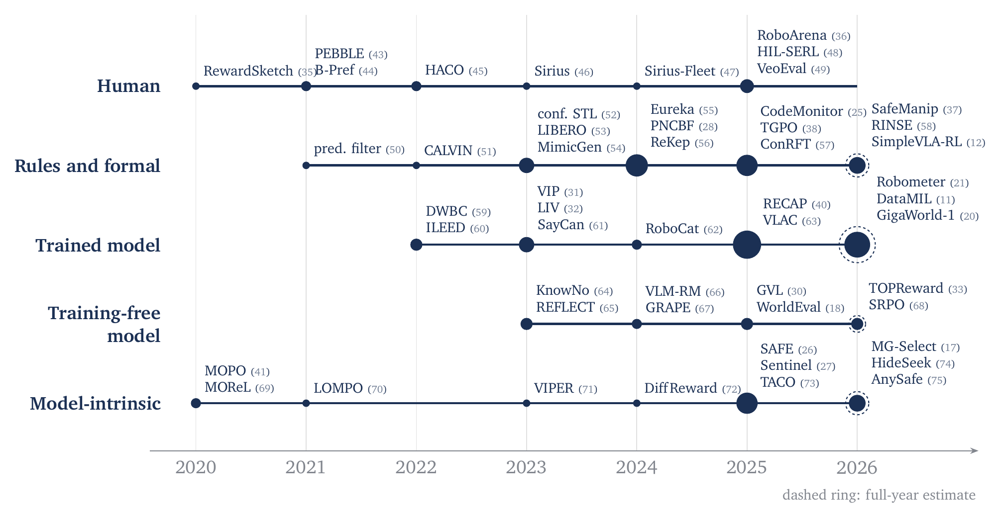
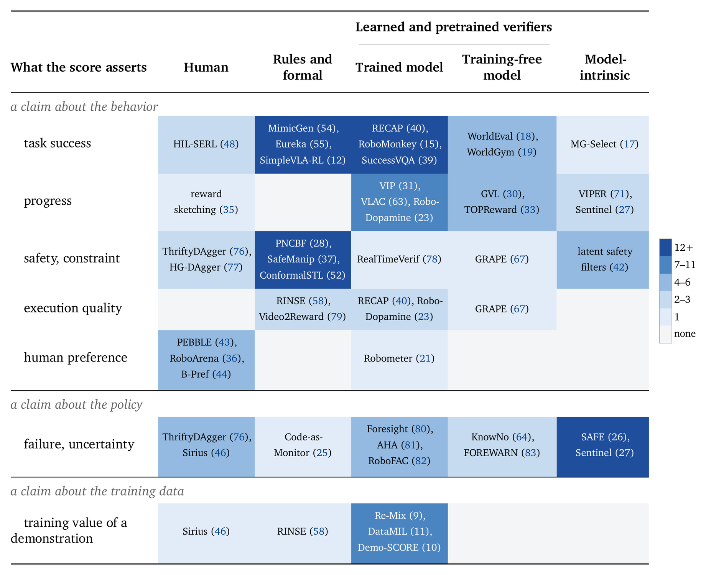
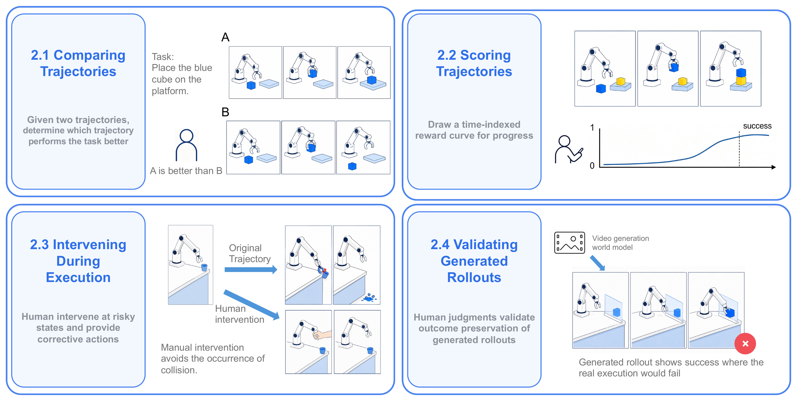
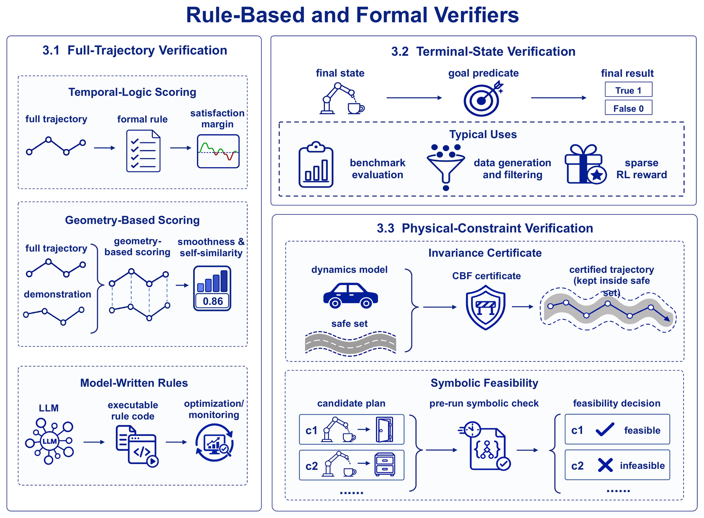
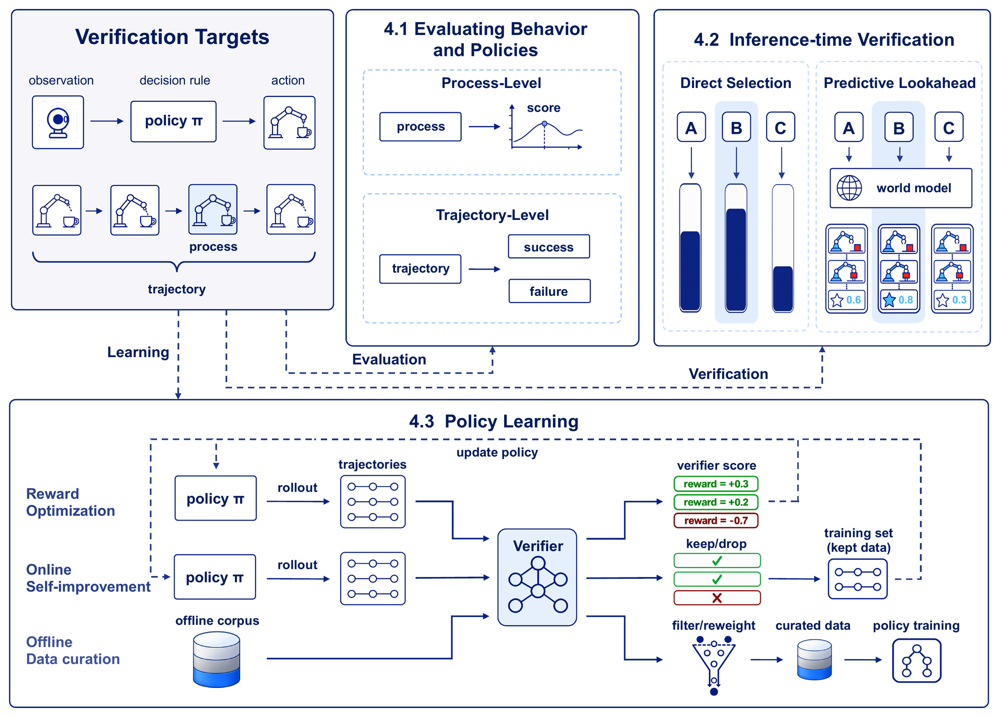
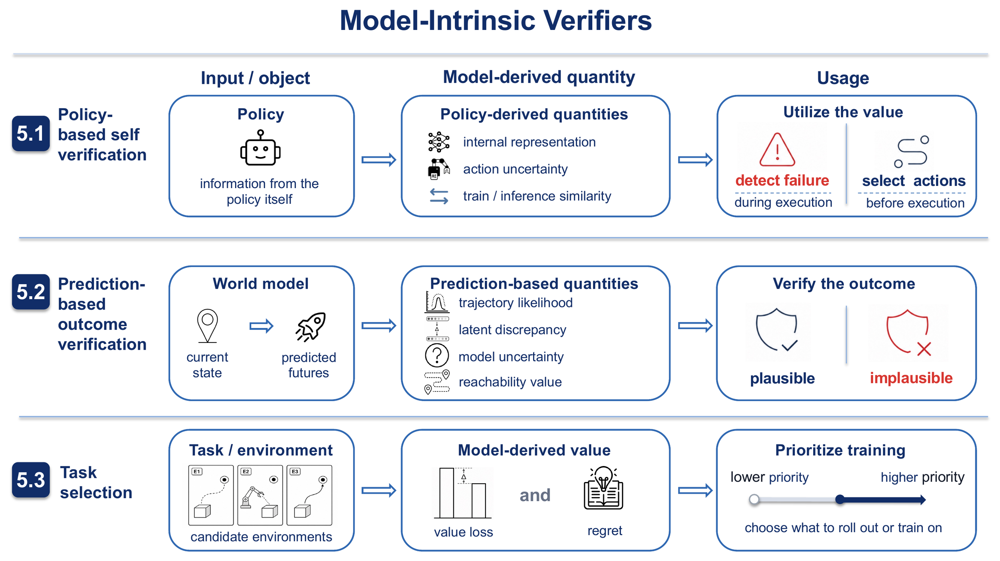

<a id="readme-top"></a>

<div align="center">

<h1>🤖&ensp;Awesome Robot Verifier</h1>

<strong>A searchable reading list of <em>verifiers for robot policies</em> — anything that reads a candidate robot behaviour and returns a score, plus the work that measures how good such a score is.</strong><br>

<p align="center">
🌐 <a href="https://zjuscl.github.io/Awesome-Robot-Verifier/"><b>Website</b></a>&ensp;•&ensp;
🗂️ <a href="#contents"><b>Contents</b></a>&ensp;•&ensp;
🤝 <a href="CONTRIBUTING.md"><b>Contribute</b></a>
</p>

  <!-- TODO(links): add an arXiv entry to the row above once the preprint is public. -->

</div>

> 🤝 Contributions are welcome: correct a record the manuscript already uses, or add the paper to the manuscript before proposing it here.

> ✉️ Contact: wanyang@zju.edu.cn

<div align="center">

<br>
<em>The four judge sources, ordered by who supplies the judgment. Availability rises from left to right and credibility falls with it.</em>
</div>

---

<div id="contents"></div>
<div id="toc"></div>

## 🗂️ Contents

**Part I** is the survey's four judge sources, §2 to §5 of the paper: every verifier method, filed by who supplies the judgment. **Part II** is §6 and the background — how a verifier is validated, and the policies, corpora, and generators it is pointed at.

**Part I — verifier methods, by who supplies the judgment**

- [§2 Human verifiers](#human-verifiers) `15`
  - [Pairwise preference comparison](#human.pairwise-preference-comparison) `4`
  - [Scalar and per-timestep annotation](#human.scalar-and-per-timestep-annotation) `1`
  - [Human-in-the-loop intervention](#human.human-in-the-loop-intervention) `8`
  - [Human validation of generated rollouts](#human.human-validation-of-generated-rollouts) `2`
- [§3 Rule-based and formal verifiers](#rule-based-and-formal-verifiers) `43`
  - [Temporal-logic specifications and satisfaction margins](#rules.temporal-logic-specifications-and-satisfaction-margins) `7`
  - [Trajectory-geometry scoring](#rules.trajectory-geometry-scoring) `1`
  - [LLM-written reward and monitor code](#rules.llm-written-reward-and-monitor-code) `7`
  - [Goal predicates in simulation benchmarks](#rules.goal-predicates-in-simulation-benchmarks) `11`
  - [Predicate-filtered demonstration generation](#rules.predicate-filtered-demonstration-generation) `6`
  - [Sparse binary reward for policy training](#rules.sparse-binary-reward-for-policy-training) `4`
  - [Control barrier functions and safety filters](#rules.control-barrier-functions-and-safety-filters) `5`
  - [Symbolic feasibility and task-and-motion planning](#rules.symbolic-feasibility-and-task-and-motion-planning) `2`
- [§4 Learned and pretrained verifiers](#learned-and-pretrained-verifiers) `55`
  - [Dense and process-level reward models](#scorers.dense-and-process-level-reward-models) `15`
  - [Success detection and trajectory-level judgment](#scorers.success-detection-and-trajectory-level-judgment) `5`
  - [Inference-time candidate ranking](#scorers.inference-time-candidate-ranking) `8`
  - [World-model lookahead and failure prediction](#scorers.world-model-lookahead-and-failure-prediction) `4`
  - [Learned reward for policy optimization](#scorers.learned-reward-for-policy-optimization) `9`
  - [Self-improvement and rollout filtering](#scorers.self-improvement-and-rollout-filtering) `5`
  - [Data curation and demonstration scoring](#scorers.data-curation-and-demonstration-scoring) `9`
- [§5 Model-intrinsic verifiers](#model-intrinsic-verifiers) `25`
  - [Runtime failure detection and gating](#intrinsic.runtime-failure-detection-and-gating) `7`
  - [Action selection from policy self-consistency](#intrinsic.action-selection-from-policy-self-consistency) `2`
  - [Generative likelihood and latent discrepancy](#intrinsic.generative-likelihood-and-latent-discrepancy) `3`
  - [Model uncertainty and ensemble disagreement](#intrinsic.model-uncertainty-and-ensemble-disagreement) `4`
  - [Reachability values and latent safety filters](#intrinsic.reachability-values-and-latent-safety-filters) `7`
  - [Task and environment selection](#intrinsic.task-and-environment-selection) `2`

**Part II — validating a verifier, and what it is pointed at**

- [§6.1 Benchmarks that take the verifier as the system under test](#verifier-benchmarks) `6`
- [§6.1 Statistical policy comparison and evaluation practice](#policy-evaluation-methodology) `9`
- [§6.1 Real-robot and sim-to-real evaluation platforms](#evaluation-platforms) `6`
- [§6.3 Reward hacking and overoptimization](#reward-hacking) `11`
- [§6.3 Conformal calibration and distribution shift](#conformal-calibration) `4`
- [§1 Policies, corpora, and simulators](#subjects) `10`
  - [Generalist policies and corpora](#subjects.generalist-policies-and-corpora) `6`
  - [World models and simulators](#subjects.world-models-and-simulators) `4`

Also: [Citation](#citation) · [License](#license)

### How to read an entry

```
- **`arXiv 2026`** [Paper Title](link). *First author et al.* `BibKey`
       venue+year                                             citation key in the survey
```

The four judge sources of Part I differ along two properties, and the survey's whole argument is that they move in opposite directions. **Availability** is how much a verdict costs, how early in a rollout it arrives, and how often it can be asked for. **Credibility** is how much a high score tells you about the task.

| Judge source | Availability | Credibility |
| --- | --- | --- |
| [Human](#human-verifiers) | costly and sparse; each judgment takes human effort | the most direct reference to what the task was meant to be |
| [Rule-based and formal](#rule-based-and-formal-verifiers) | inexpensive and repeatable, once the state it reads is available | the strongest guarantees here — but only where the predicate, the state estimate, and the dynamics assumptions represent the task |
| [Learned and pretrained](#learned-and-pretrained-verifiers) | inexpensive to query, dense across tasks and trajectories | bounded by the data the model was trained and validated on |
| [Model-intrinsic](#model-intrinsic-verifiers) | cheapest of the four; the model already computes it | describes the model, not the task |

<div align="center">

<br>
<em>Representative systems by judge source and year. Disc area is the number of papers covered at that point; a dashed ring on 2026 is the full-year estimate. The search closes in early July 2026.</em>
</div>

<div align="center">

<br>
<em>What the score asserts, plotted against the judge source supplying the criterion. Fill depth is the number of papers in the cell.</em>
</div>

---

# Part I — verifier methods, by who supplies the judgment

`138` papers across the four judge sources, following §2 to §5 of the survey.

<div id="human-verifiers"></div>

## §2 · Human verifiers <sub><a href="#toc">↑ contents</a></sub>

> A person supplies the judgment, by comparison, by score, or by taking over the controls.

<div align="center">

<br><em>Four roles of the human verifier: comparing trajectories, scoring them, intervening during execution, and validating generated rollouts.</em>
</div>

<div id="human.pairwise-preference-comparison"></div>

### Pairwise preference comparison

- **`CoRL 2025`** [RoboArena: Distributed Real-World Evaluation of Generalist Robot Policies](https://arxiv.org/abs/2506.18123). *Atreya et al.* `RoboArena`
- **`NeurIPS D&B 2021`** [B-Pref: Benchmarking Preference-Based Reinforcement Learning](https://arxiv.org/abs/2111.03026). *Lee et al.* `BPref`
- **`ICML 2021`** [PEBBLE: Feedback-Efficient Interactive Reinforcement Learning via Relabeling Experience and Unsupervised Pre-training](https://arxiv.org/abs/2106.05091). *Lee et al.* `PEBBLE`
- **`NeurIPS 2017`** [Deep reinforcement learning from human preferences](https://arxiv.org/abs/1706.03741). *Christiano et al.* `ChristianoPrefs`

<div id="human.scalar-and-per-timestep-annotation"></div>

### Scalar and per-timestep annotation

- **`RSS 2020`** [Scaling data-driven robotics with reward sketching and batch reinforcement learning](https://arxiv.org/abs/1909.12200). *Cabi et al.* `RewardSketching`

<div id="human.human-in-the-loop-intervention"></div>

### Human-in-the-loop intervention

- **`Science Robotics 2025`** [Precise and Dexterous Robotic Manipulation via Human-in-the-Loop Reinforcement Learning](https://arxiv.org/abs/2410.21845). *Luo et al.* `HIL-SERL`
- **`ICML 2025`** [Robot-Gated Interactive Imitation Learning with Adaptive Intervention Mechanism](https://proceedings.mlr.press/v267/cai25e.html). *Cai et al.* `AIM`
- **`CoRL 2024`** [Multi-Task Interactive Robot Fleet Learning with Visual World Models](https://arxiv.org/abs/2410.22689). *Liu et al.* `liu2024siriusfleet`
- **`RSS 2023`** [Robot Learning on the Job: Human-in-the-Loop Autonomy and Learning During Deployment](https://roboticsproceedings.org/rss19/p005.html). *Liu et al.* `Sirius`
- **`ICLR 2022`** [Efficient Learning of Safe Driving Policy via Human-AI Copilot Optimization](https://openreview.net/forum?id=0cgU-BZp2ky). *Li et al.* `HACO`
- **`CoRL 2022`** [ThriftyDAgger: Budget-Aware Novelty and Risk Gating for Interactive Imitation Learning](https://arxiv.org/abs/2109.08273). *Hoque et al.* `ThriftyDAgger`
- **`ICRA 2019`** [HG-DAgger: Interactive Imitation Learning with Human Experts](https://doi.org/10.1109/ICRA.2019.8793698). *Kelly et al.* `HGDagger`
- **`AISTATS 2011`** [A Reduction of Imitation Learning and Structured Prediction to No-Regret Online Learning](https://arxiv.org/abs/1011.0686). *Ross et al.* `ross2011dagger`

<div id="human.human-validation-of-generated-rollouts"></div>

### Human validation of generated rollouts

- **`arXiv 2026`** [GigaWorld-1: A Roadmap to Build World Models for Robot Policy Evaluation](https://arxiv.org/abs/2607.02642). *Team et al.* `GigaWorld-1`
- **`arXiv 2025`** [Evaluating Gemini Robotics Policies in a Veo World Simulator](https://arxiv.org/abs/2512.10675). *Team et al.* `VeoEval`

---

<div id="rule-based-and-formal-verifiers"></div>

## §3 · Rule-based and formal verifiers <sub><a href="#toc">↑ contents</a></sub>

> The criterion is written before any candidate exists: a predicate, a temporal-logic specification, a certificate, or code a model generated.

<div align="center">

<br><em>Rule-based verifiers grouped by what the criterion reads: a full trajectory, the terminal state, or a model of the physics.</em>
</div>

<div id="rules.temporal-logic-specifications-and-satisfaction-margins"></div>

### Temporal-logic specifications and satisfaction margins

- **`arXiv 2026`** [Pixels to Proofs: Probabilistically-Safe Latent World Model Control via Parallel Conformal Robust MPC](https://arxiv.org/abs/2606.15594). *Nath et al.* `SLS2`
- **`arXiv 2026`** [SafeManip: A Property-Driven Benchmark for Temporal Safety Evaluation in Robotic Manipulation](https://arxiv.org/abs/2605.12386). *Huang et al.* `SafeManip`
- **`ACM TCPS 2025`** [Distributionally Robust Predictive Runtime Verification under Spatio-Temporal Logic Specifications](https://arxiv.org/abs/2504.02964). *Zhao et al.* `DistRobustPRV`
- **`TMLR 2025`** [LTL-Constrained Policy Optimization with Cycle Experience Replay](https://arxiv.org/abs/2404.11578). *Shah et al.* `LTL-CER`
- **`arXiv 2025`** [TGPO: Temporal Grounded Policy Optimization for Signal Temporal Logic Tasks](https://arxiv.org/abs/2510.00225). *Meng et al.* `TGPO`
- **`ICCPS 2024`** [Robust Conformal Prediction for STL Runtime Verification under Distribution Shift](https://arxiv.org/abs/2311.09482). *Zhao et al.* `RobustConformalSTL`
- **`ICCPS 2023`** [Conformal Prediction for STL Runtime Verification](https://arxiv.org/abs/2211.01539). *Lindemann et al.* `ConformalSTL`

<div id="rules.trajectory-geometry-scoring"></div>

### Trajectory-geometry scoring

- **`arXiv 2026`** [Learning from the Best: Smoothness-Driven Metrics for Data Quality in Imitation Learning](https://arxiv.org/abs/2604.23000). *Kulkarni et al.* `RINSE`

<div id="rules.llm-written-reward-and-monitor-code"></div>

### LLM-written reward and monitor code

- **`CVPR 2025`** [Code-as-Monitor: Constraint-aware Visual Programming for Reactive and Proactive Robotic Failure Detection](https://arxiv.org/abs/2412.04455). *Zhou et al.* `Code-as-Monitor`
- **`RSS 2024`** [DrEureka: Language Model Guided Sim-To-Real Transfer](https://arxiv.org/abs/2406.01967). *Ma et al.* `DrEureka`
- **`ICLR 2024`** [Eureka: Human-Level Reward Design via Coding Large Language Models](https://arxiv.org/abs/2310.12931). *Ma et al.* `Eureka`
- **`CoRL 2024`** [ReKep: Spatio-Temporal Reasoning of Relational Keypoint Constraints for Robotic Manipulation](https://arxiv.org/abs/2409.01652). *Huang et al.* `ReKep`
- **`ICLR 2024`** [Text2Reward: Reward Shaping with Language Models for Reinforcement Learning](https://arxiv.org/abs/2309.11489). *Xie et al.* `Text2Reward`
- **`ECAI 2024`** [Video2Reward: Generating Reward Function from Videos for Legged Robot Behavior Learning](https://arxiv.org/abs/2412.05515). *Zeng et al.* `Video2Reward`
- **`CoRL 2023`** [Language to Rewards for Robotic Skill Synthesis](https://arxiv.org/abs/2306.08647). *Yu et al.* `L2R`

<div id="rules.goal-predicates-in-simulation-benchmarks"></div>

### Goal predicates in simulation benchmarks

- **`ICML 2026`** [RoboTwin 2.0: A Scalable Data Generator and Benchmark with Strong Domain Randomization for Robust Bimanual Robotic Manipulation](https://arxiv.org/abs/2506.18088). *Chen et al.* `RoboTwin2`
- **`CVPR 2025`** [GENMANIP: LLM-driven Simulation for Generalizable Instruction-Following Manipulation](https://arxiv.org/abs/2506.10966). *Gao et al.* `GenManip`
- **`arXiv 2025`** [Isaac Lab: A GPU-Accelerated Simulation Framework for Multi-Modal Robot Learning](https://arxiv.org/abs/2511.04831). *Mittal et al.* `isaaclab2025`
- **`RSS 2025`** [RoboVerse: A Unified Platform, Benchmark and Dataset for Scalable and Generalizable Robot Learning](https://arxiv.org/abs/2504.18904). *Geng et al.* `RoboVerse`
- **`ICCV 2025`** [VLABench: A Large-Scale Benchmark for Language-Conditioned Robotics Manipulation with Long-Horizon Reasoning Tasks](https://arxiv.org/abs/2412.18194). *Zhang et al.* `VLABench`
- **`arXiv 2024`** [BEHAVIOR-1K: A Human-Centered, Embodied AI Benchmark with 1,000 Everyday Activities and Realistic Simulation](https://arxiv.org/abs/2403.09227). *Li et al.* `BEHAVIOR-1K`
- **`arXiv 2024`** [ManiSkill3: GPU Parallelized Robotics Simulation and Rendering for Generalizable Embodied AI](https://arxiv.org/abs/2410.00425). *Tao et al.* `ManiSkill`
- **`RSS 2024`** [RoboCasa: Large-Scale Simulation of Household Tasks for Generalist Robots](https://arxiv.org/abs/2406.02523). *Nasiriany et al.* `RoboCasa`
- **`RSS 2024`** [THE COLOSSEUM: A Benchmark for Evaluating Generalization for Robotic Manipulation](https://arxiv.org/abs/2402.08191). *Pumacay et al.* `pumacay2024colosseum`
- **`NeurIPS D&B 2023`** [LIBERO: Benchmarking Knowledge Transfer for Lifelong Robot Learning](https://arxiv.org/abs/2306.03310). *Liu et al.* `LIBERO`
- **`ICRA 2022`** [CALVIN: A Benchmark for Language-Conditioned Policy Learning for Long-Horizon Robot Manipulation Tasks](https://arxiv.org/abs/2112.03227). *Mees et al.* `CALVIN`

<div id="rules.predicate-filtered-demonstration-generation"></div>

### Predicate-filtered demonstration generation

- **`RSS 2025`** [DemoGen: Synthetic Demonstration Generation for Data-Efficient Visuomotor Policy Learning](https://arxiv.org/abs/2502.16932). *Xue et al.* `DemoGen`
- **`ICRA 2025`** [DexMimicGen: Automated Data Generation for Bimanual Dexterous Manipulation via Imitation Learning](https://arxiv.org/abs/2410.24185). *Jiang et al.* `DexMimicGen`
- **`CoRL 2025`** [GenSim2: Scaling Robot Data Generation with Multi-modal and Reasoning LLMs](https://arxiv.org/abs/2410.03645). *Hua et al.* `GenSim2`
- **`ICLR 2024`** [GenSim: Generating Robotic Simulation Tasks via Large Language Models](https://arxiv.org/abs/2310.01361). *Wang et al.* `GenSim`
- **`ICML 2024`** [RoboGen: Towards Unleashing Infinite Data for Automated Robot Learning via Generative Simulation](https://arxiv.org/abs/2311.01455). *Wang et al.* `RoboGen`
- **`CoRL 2023`** [MimicGen: A Data Generation System for Scalable Robot Learning using Human Demonstrations](https://arxiv.org/abs/2310.17596). *Mandlekar et al.* `MimicGen`

<div id="rules.sparse-binary-reward-for-policy-training"></div>

### Sparse binary reward for policy training

- **`RSS 2026`** [RLinf-VLA: A Unified and Efficient Framework for Reinforcement Learning of Vision-Language-Action Models](https://arxiv.org/abs/2510.06710). *Zang et al.* `RLinf-VLA`
- **`ICLR 2026`** [SimpleVLA-RL: Scaling VLA Training via Reinforcement Learning](https://arxiv.org/abs/2509.09674). *Li et al.* `SimpleVLA-RL`
- **`RSS 2025`** [ConRFT: A Reinforced Fine-tuning Method for VLA Models via Consistency Policy](https://arxiv.org/abs/2502.05450). *Chen et al.* `ConRFT`
- **`arXiv 2025`** [Interactive Post-Training for Vision-Language-Action Models](https://arxiv.org/abs/2505.17016). *Tan et al.* `RIPT-VLA`

<div id="rules.control-barrier-functions-and-safety-filters"></div>

### Control barrier functions and safety filters

- **`ICRA 2024`** [How to Train Your Neural Control Barrier Function: Learning Safety Filters for Complex Input-Constrained Systems](https://arxiv.org/abs/2310.15478). *So et al.* `PNCBF`
- **`Annu. Rev. Control 2024`** [The Safety Filter: A Unified View of Safety-Critical Control in Autonomous Systems](https://doi.org/10.1146/annurev-control-071723-102940). *Hsu et al.* `hsu2024safetyfilter`
- **`arXiv 2023`** [Value Functions are Control Barrier Functions: Verification of Safe Policies using Control Theory](https://arxiv.org/abs/2306.04026). *Tan et al.* `ValueIsCBF`
- **`Automatica 2021`** [A Predictive Safety Filter for Learning-Based Control of Constrained Nonlinear Dynamical Systems](https://doi.org/10.1016/j.automatica.2021.109597). *Wabersich et al.* `wabersich2021psf`
- **`ECC 2019`** [Control Barrier Functions: Theory and Applications](https://doi.org/10.23919/ECC.2019.8796030). *Ames et al.* `ames2019cbf`

<div id="rules.symbolic-feasibility-and-task-and-motion-planning"></div>

### Symbolic feasibility and task-and-motion planning

- **`Autonomous Robots 2023`** [Text2Motion: From Natural Language Instructions to Feasible Plans](https://arxiv.org/abs/2303.12153). *Lin et al.* `Text2Motion`
- **`ICRA 2014`** [Combined Task and Motion Planning through an Extensible Planner-Independent Interface Layer](https://scholar.google.com/scholar?q=Combined%20Task%20and%20Motion%20Planning%20through%20an%20Extensible%20Planner-Independent%20Interface%20Layer). *Srivastava et al.* `PlannerInterface`

---

<div id="learned-and-pretrained-verifiers"></div>

## §4 · Learned and pretrained verifiers <sub><a href="#toc">↑ contents</a></sub>

> A neural model returns the score, either trained on task-specific robot data or queried straight from pretraining.

<div align="center">

<br><em>The three roles a learned verifier plays: measuring an execution, choosing among candidates at inference time, and feeding a score back into policy training or data curation.</em>
</div>

<div id="scorers.dense-and-process-level-reward-models"></div>

### Dense and process-level reward models

- **`arXiv 2026`** [Large Reward Models: Generalizable Online Robot Reward Generation with Vision-Language Models](https://arxiv.org/abs/2603.16065). *Wu et al.* `wu2026lrm`
- **`arXiv 2026`** [PRM-as-a-Judge: A Dense Evaluation Paradigm for Fine-Grained Robotic Auditing](https://arxiv.org/abs/2603.21669). *Ji et al.* `prm_as_a_judge2026`
- **`arXiv 2026`** [ProcVLM: Learning Procedure-Grounded Progress Rewards for Robotic Manipulation](https://arxiv.org/abs/2605.08774). *Feng et al.* `ProcVLM`
- **`CVPR 2026`** [Robo-Dopamine: General Process Reward Modeling for High-Precision Robotic Manipulation](https://arxiv.org/abs/2512.23703). *Tan et al.* `Robo-Dopamine`
- **`RSS 2026`** [Robometer: Scaling General-Purpose Robotic Reward Models via Trajectory Comparisons](https://arxiv.org/abs/2603.02115). *Liang et al.* `Robometer`
- **`arXiv 2026`** [TOPReward: Token Probabilities as Hidden Zero-Shot Rewards for Robotics](https://arxiv.org/abs/2602.19313). *Chen et al.* `TOPReward`
- **`arXiv 2025`** [A Vision-Language-Action-Critic Model for Robotic Real-World Reinforcement Learning](https://arxiv.org/abs/2509.15937). *Zhai et al.* `VLAC`
- **`ICLR 2025`** [AHA: A Vision-Language-Model for Detecting and Reasoning Over Failures in Robotic Manipulation](https://arxiv.org/abs/2410.00371). *Duan et al.* `AHA`
- **`ICLR 2025`** [Vision Language Models are In-Context Value Learners](https://arxiv.org/abs/2411.04549). *Ma et al.* `GVL`
- **`ICLR 2024`** [Vision-Language Models are Zero-Shot Reward Models for Reinforcement Learning](https://arxiv.org/abs/2310.12921). *Rocamonde et al.* `rocamonde2024vlmrm`
- **`ICML 2023`** [LIV: Language-Image Representations and Rewards for Robotic Control](https://arxiv.org/abs/2306.00958). *Ma et al.* `LIV`
- **`CoRL 2023`** [REFLECT: Summarizing Robot Experiences for Failure Explanation and Correction](https://arxiv.org/abs/2306.15724). *Liu et al.* `liu2023reflect`
- **`NeurIPS 2023`** [RoboCLIP: One Demonstration is Enough to Learn Robot Policies](https://arxiv.org/abs/2310.07899). *Sontakke et al.* `sontakke2023roboclip`
- **`ICLR 2023`** [VIP: Towards Universal Visual Reward and Representation via Value-Implicit Pre-Training](https://arxiv.org/abs/2210.00030). *Ma et al.* `VIP`
- **`CoLLAs 2023`** [Vision-Language Models as Success Detectors](https://arxiv.org/abs/2303.07280). *Du et al.* `SuccessVQA`

<div id="scorers.success-detection-and-trajectory-level-judgment"></div>

### Success detection and trajectory-level judgment

- **`ICLR 2026`** [RobotArena \infty: Scalable Robot Benchmarking via Real-to-Sim Translation](https://arxiv.org/abs/2510.23571). *Jangir et al.* `robotarena_infty2025`
- **`ICLR 2026`** [WorldGym: World Model as An Environment for Policy Evaluation](https://arxiv.org/abs/2506.00613). *Quevedo et al.* `WorldGym`
- **`CoRL 2025`** [AutoEval: Autonomous Evaluation of Generalist Robot Manipulation Policies in the Real World](https://arxiv.org/abs/2503.24278). *Zhou et al.* `AutoEval`
- **`arXiv 2025`** [RoboFAC: A Comprehensive Framework for Robotic Failure Analysis and Correction](https://arxiv.org/abs/2505.12224). *Ye et al.* `RoboFAC`
- **`arXiv 2025`** [WorldEval: World Model as Real-World Robot Policies Evaluator](https://arxiv.org/abs/2505.19017). *Li et al.* `WorldEval`

<div id="scorers.inference-time-candidate-ranking"></div>

### Inference-time candidate ranking

- **`arXiv 2026`** [E-TTS: A New Embodied Test-Time Scaling Framework for Robotic Manipulation](https://arxiv.org/abs/2606.27268). *Ye et al.* `E-TTS`
- **`ICML 2026`** [TapSampling: Inference-Time Sampling with a Task-Progress-Understanding Verifier for Robotic Manipulation](https://arxiv.org/abs/2605.25547). *Zhao et al.* `TapSampling`
- **`arXiv 2026`** [VLA-ATTC: Adaptive Test-Time Compute for VLA Models with Relative Action Critic Model](https://arxiv.org/abs/2605.01194). *Li et al.* `VLA-ATTC`
- **`CoRL 2025`** [RoboMonkey: Scaling Test-Time Sampling and Verification for Vision-Language-Action Models](https://arxiv.org/abs/2506.17811). *Kwok et al.* `RoboMonkey`
- **`arXiv 2025`** [RoVer: Robot Reward Model as Test-Time Verifier for Vision-Language-Action Model](https://arxiv.org/abs/2510.10975). *Dai et al.* `RoVer`
- **`CoRL 2025`** [Steering Your Generalists: Improving Robotic Foundation Models via Value Guidance](https://arxiv.org/abs/2410.13816). *Nakamoto et al.* `V-GPS`
- **`CoRL 2023`** [Do As I Can, Not As I Say: Grounding Language in Robotic Affordances](https://arxiv.org/abs/2204.01691). *Ichter et al.* `SayCan`
- **`CoRL 2023`** [Robots That Ask For Help: Uncertainty Alignment for Large Language Model Planners](https://arxiv.org/abs/2307.01928). *Ren et al.* `KnowNo`

<div id="scorers.world-model-lookahead-and-failure-prediction"></div>

### World-model lookahead and failure prediction

- **`arXiv 2026`** [Foresight: Failure Detection for Long-Horizon Robotic Manipulation with Action-Conditioned World Model Latents](https://arxiv.org/abs/2606.23085). *Zhang et al.* `Foresight`
- **`arXiv 2026`** [Intercepting the Future: Latent-Space Predictive World Model for Dynamic VLA Manipulation](https://arxiv.org/abs/2606.02486). *Syed et al.* `AHEAD`
- **`arXiv 2026`** [Robot Critics that Sweat the Small Stuff](https://arxiv.org/abs/2606.21572). *Sudhakar et al.* `RobotCritics`
- **`RSS 2025`** [From Foresight to Forethought: VLM-In-the-Loop Policy Steering via Latent Alignment](https://arxiv.org/abs/2502.01828). *Wu et al.* `FOREWARN`

<div id="scorers.learned-reward-for-policy-optimization"></div>

### Learned reward for policy optimization

- **`arXiv 2026`** [EVA: Aligning Video World Models with Executable Robot Actions via Inverse Dynamics Rewards](https://arxiv.org/abs/2603.17808). *Wang et al.* `wang2026eva`
- **`CVPR 2026`** [SRPO: Self-Referential Policy Optimization for Vision-Language-Action Models](https://arxiv.org/abs/2511.15605). *Fei et al.* `SRPO`
- **`arXiv 2026`** [World Value Models for Robotic Manipulation](https://arxiv.org/abs/2606.24742). *Wang et al.* `wang2026wvm`
- **`ICLR 2025`** [GRAPE: Generalizing Robot Policy via Preference Alignment](https://arxiv.org/abs/2411.19309). *Zhang et al.* `GRAPE`
- **`arXiv 2025`** [VLA-RFT: Vision-Language-Action Reinforcement Fine-tuning with Verified Rewards in World Simulators](https://arxiv.org/abs/2510.00406). *Li et al.* `VLA-RFT`
- **`arXiv 2025`** [VLA-RL: Towards Masterful and General Robotic Manipulation with Scalable Reinforcement Learning](https://arxiv.org/abs/2505.18719). *Lu et al.* `VLA-RL`
- **`arXiv 2025`** [π*0.6: a VLA That Learns From Experience](https://arxiv.org/abs/2511.14759). *Intelligence et al.* `RECAP`
- **`ICLR 2024`** [Motif: Intrinsic Motivation from Artificial Intelligence Feedback](https://arxiv.org/abs/2310.00166). *Klissarov et al.* `klissarov2024motif`
- **`ICML 2024`** [RL-VLM-F: Reinforcement Learning from Vision Language Foundation Model Feedback](https://arxiv.org/abs/2402.03681). *Wang et al.* `RL-VLM-F`

<div id="scorers.self-improvement-and-rollout-filtering"></div>

### Self-improvement and rollout filtering

- **`RSS 2025`** [Curating Demonstrations using Online Experience](https://arxiv.org/abs/2503.03707). *Chen et al.* `Demo-SCORE`
- **`arXiv 2025`** [Human-in-the-loop Online Rejection Sampling for Robotic Manipulation](https://arxiv.org/abs/2510.26406). *Lu et al.* `Hi-ORS`
- **`arXiv 2025`** [Real-Time Verification of Embodied Reasoning for Generative Skill Acquisition](https://arxiv.org/abs/2505.11175). *Yue et al.* `RealTimeVerif`
- **`NeurIPS 2025`** [Self-Improving Embodied Foundation Models](https://arxiv.org/abs/2509.15155). *Ghasemipour et al.* `SelfImprovingEFM`
- **`TMLR 2024`** [RoboCat: A Self-Improving Generalist Agent for Robotic Manipulation](https://arxiv.org/abs/2306.11706). *Bousmalis et al.* `RoboCat`

<div id="scorers.data-curation-and-demonstration-scoring"></div>

### Data curation and demonstration scoring

- **`ICLR 2026`** [DataMIL: Selecting Data for Robot Imitation Learning with Datamodels](https://arxiv.org/abs/2505.09603). *Dass et al.* `DataMIL`
- **`ICRA 2026`** [SCIZOR: A Self-Supervised Approach to Data Curation for Large-Scale Imitation Learning](https://arxiv.org/abs/2505.22626). *Zhang et al.* `SCIZOR`
- **`ICLR 2025`** [Data Scaling Laws in Imitation Learning for Robotic Manipulation](https://arxiv.org/abs/2410.18647). *Lin et al.* `DataScalingLaws`
- **`CoRL 2025`** [ReMix: Optimizing Data Mixtures for Large Scale Imitation Learning](https://arxiv.org/abs/2408.14037). *Hejna et al.* `Re-Mix`
- **`RSS 2025`** [Robot Data Curation with Mutual Information Estimators](https://arxiv.org/abs/2502.08623). *Hejna et al.* `DemInf`
- **`NeurIPS 2023`** [Data Quality in Imitation Learning](https://arxiv.org/abs/2306.02437). *Belkhale et al.* `DataQualityIL`
- **`ICLR 2022`** [DemoDICE: Offline Imitation Learning with Supplementary Imperfect Demonstrations](https://openreview.net/forum?id=BrPdX1bDZkQ). *Kim et al.* `DemoDICE`
- **`ICML 2022`** [Discriminator-Weighted Offline Imitation Learning from Suboptimal Demonstrations](https://arxiv.org/abs/2207.10050). *Xu et al.* `DWBC`
- **`ICML 2022`** [Imitation Learning by Estimating Expertise of Demonstrators](https://arxiv.org/abs/2202.01288). *Beliaev et al.* `ILEED`

---

<div id="model-intrinsic-verifiers"></div>

## §5 · Model-intrinsic verifiers <sub><a href="#toc">↑ contents</a></sub>

> The score is a quantity the policy or the world model already computes; no second model is trained to produce it.

<div align="center">

<br><em>Signals read out of the robot's own policy or world model, used for failure detection, candidate selection, outcome verification, and choosing what to train on next.</em>
</div>

<div id="intrinsic.runtime-failure-detection-and-gating"></div>

### Runtime failure detection and gating

- **`arXiv 2026`** [AEGIS: A Backup Reflex for Physical AI](https://arxiv.org/abs/2606.06660). *Chen* `aegis2026`
- **`arXiv 2026`** [Hide-and-Seek in Trajectories: Discovering Failure Signals for VLA Runtime Monitoring](https://arxiv.org/abs/2605.30834). *Park et al.* `HideAndSeek`
- **`arXiv 2026`** [Tri-Info: Generalizable, Interpretable Failure Prediction for VLA Models via Information Theory](https://arxiv.org/abs/2606.19998). *Yang et al.* `Tri-Info`
- **`RSS 2025`** [Can We Detect Failures Without Failure Data? Uncertainty-Aware Runtime Failure Detection for Imitation Learning Policies](https://arxiv.org/abs/2503.08558). *Xu et al.* `FAILDetect`
- **`NeurIPS 2025`** [Failure Prediction at Runtime for Generative Robot Policies](https://arxiv.org/abs/2510.09459). *Römer et al.* `RoemerFailPred`
- **`NeurIPS 2025`** [SAFE: Multitask Failure Detection for Vision-Language-Action Models](https://arxiv.org/abs/2506.09937). *Gu et al.* `SAFE`
- **`CoRL 2025`** [Unpacking Failure Modes of Generative Policies: Runtime Monitoring of Consistency and Progress](https://arxiv.org/abs/2410.04640). *Agia et al.* `Sentinel`

<div id="intrinsic.action-selection-from-policy-self-consistency"></div>

### Action selection from policy self-consistency

- **`ICLR 2026`** [Verifier-free Test-Time Sampling for Vision-Language-Action Models](https://arxiv.org/abs/2510.05681). *Jang et al.* `MG-Select`
- **`arXiv 2025`** [Steering Vision-Language-Action Models as Anti-Exploration: A Test-Time Scaling Approach](https://arxiv.org/abs/2512.02834). *Yang et al.* `TACO`

<div id="intrinsic.generative-likelihood-and-latent-discrepancy"></div>

### Generative likelihood and latent discrepancy

- **`arXiv 2025`** [Intuitive physics understanding emerges from self-supervised pretraining on natural videos](https://arxiv.org/abs/2502.11831). *Garrido et al.* `VJEPAPhysics`
- **`ECCV 2024`** [Diffusion Reward: Learning Rewards via Conditional Video Diffusion](https://arxiv.org/abs/2312.14134). *Huang et al.* `DiffusionReward`
- **`NeurIPS 2023`** [Video Prediction Models as Rewards for Reinforcement Learning](https://arxiv.org/abs/2305.14343). *Escontrela et al.* `VIPER`

<div id="intrinsic.model-uncertainty-and-ensemble-disagreement"></div>

### Model uncertainty and ensemble disagreement

- **`ICRA 2026`** [Foundational World Models Accurately Detect Bimanual Manipulator Failures](https://arxiv.org/abs/2603.06987). *Ward et al.* `ward2026foundational`
- **`L4DC 2021`** [Offline Reinforcement Learning from Images with Latent Space Models](https://arxiv.org/abs/2012.11547). *Rafailov et al.* `LOMPO`
- **`NeurIPS 2020`** [MOPO: Model-based Offline Policy Optimization](https://arxiv.org/abs/2005.13239). *Yu et al.* `MOPO`
- **`NeurIPS 2020`** [MOReL: Model-Based Offline Reinforcement Learning](https://arxiv.org/abs/2005.05951). *Kidambi et al.* `MOReL`

<div id="intrinsic.reachability-values-and-latent-safety-filters"></div>

### Reachability values and latent safety filters

- **`ICRA 2026`** [AnySafe: Adapting Latent Safety Filters at Runtime via Safety Constraint Parameterization in the Latent Space](https://arxiv.org/abs/2509.19555). *Agrawal et al.* `agrawal2025anysafe`
- **`L4DC 2026`** [How to Train Your Latent Control Barrier Function: Smooth Safety Filtering Under Hard-to-Model Constraints](https://arxiv.org/abs/2511.18606). *Nakamura et al.* `nakamura2025latentcbf`
- **`CoRL 2025`** [Gameplay Filters: Robust Zero-Shot Safety through Adversarial Imagination](https://arxiv.org/abs/2405.00846). *Nguyen et al.* `GameplayFilters`
- **`RSS 2025`** [Generalizing Safety Beyond Collision-Avoidance via Latent-Space Reachability Analysis](https://arxiv.org/abs/2502.00935). *Nakamura et al.* `LatentSafetyFilters`
- **`arXiv 2025`** [How Well Do Latent World Models Understand Partially Observable Safety Constraints?](https://arxiv.org/abs/2510.06492). *Kim et al.* `LatentSafetyPO`
- **`CoRL 2025`** [Uncertainty-aware Latent Safety Filters for Avoiding Out-of-Distribution Failures](https://arxiv.org/abs/2505.00779). *Seo et al.* `seo2025uncertainty`
- **`CDC 2017`** [Hamilton-Jacobi Reachability: A Brief Overview and Recent Advances](https://doi.org/10.1109/CDC.2017.8263977). *Bansal et al.* `bansal2017hj`

<div id="intrinsic.task-and-environment-selection"></div>

### Task and environment selection

- **`ICML 2022`** [Evolving Curricula with Regret-Based Environment Design](https://arxiv.org/abs/2203.01302). *Parker-Holder et al.* `ACCEL`
- **`NeurIPS 2020`** [Emergent Complexity and Zero-shot Transfer via Unsupervised Environment Design](https://arxiv.org/abs/2012.02096). *Dennis et al.* `PAIRED`

---

# Part II — validating a verifier, and what it is pointed at

`46` papers. The first five groups follow §6, which asks how a verifier's own error is measured. The last is the things a verifier is run on rather than verifiers themselves.

<div id="verifier-benchmarks"></div>

## §6.1 · Benchmarks that take the verifier as the system under test <sub><a href="#toc">↑ contents</a></sub>

> They fix the rollouts, fix a reference judgment for each one, and report how often the verifier agrees with that reference.

<div id="vbench.all"></div>

- **`arXiv 2026`** [GE-Sim 2.0: A Roadmap Towards Comprehensive Closed-loop Video World Simulators for Robotic Manipulation](https://arxiv.org/abs/2605.27491). *Qiu et al.* `GESim2`
- **`arXiv 2026`** [How Should World Models Be Evaluated for Embodied Decision-Making? A Decision-Making-Centric Position](https://arxiv.org/abs/2606.15032). *Yu et al.* `wmeval_position2026`
- **`arXiv 2026`** [RoboReward: General-Purpose Vision-Language Reward Models for Robotics](https://arxiv.org/abs/2601.00675). *Lee et al.* `RoboReward`
- **`arXiv 2026`** [SafeVLA-Bench: A Benchmark for the Success-Safety Gap in Vision-Language-Action Models](https://arxiv.org/abs/2606.00773). *Fan et al.* `SafeVLABench`
- **`arXiv 2025`** [Can AI Perceive Physical Danger and Intervene?](https://arxiv.org/abs/2509.21651). *Jindal et al.* `ASIMOV`
- **`arXiv 2025`** [OpenGVL -- Benchmarking Visual Temporal Progress for Data Curation](https://arxiv.org/abs/2509.17321). *Budzianowski et al.* `OpenGVL`

---

<div id="policy-evaluation-methodology"></div>

## §6.1 · Statistical policy comparison and evaluation practice <sub><a href="#toc">↑ contents</a></sub>

> How many rollouts a comparison takes, what interval belongs around a rate, and what a paper should report about it.

<div id="evalmethod.all"></div>

- **`Science Robotics 2026`** [A Careful Examination of Large Behavior Models for Multitask Dexterous Manipulation](https://arxiv.org/abs/2507.05331). *Barreiros et al.* `LBM`
- **`RSS 2026`** [Beyond Binary Success: Sample-Efficient and Statistically Rigorous Robot Policy Comparison](https://arxiv.org/abs/2603.13616). *Snyder et al.* `N-SCORE`
- **`arXiv 2026`** [PhAIL: A Real-Robot VLA Benchmark and Distributional Methodology](https://arxiv.org/abs/2605.29710). *Arkhangelskiy* `PhAIL`
- **`CoRL 2025`** [Efficient Evaluation of Multi-Task Robot Policies With Active Experiment Selection](https://arxiv.org/abs/2502.09829). *Anwar et al.* `ActiveEval`
- **`RSS 2025`** [Is Your Imitation Learning Policy Better than Mine? Policy Comparison with Near-Optimal Stopping](https://arxiv.org/abs/2503.10966). *Snyder et al.* `STEP`
- **`RA-L 2024`** [How Generalizable Is My Behavior Cloning Policy? A Statistical Approach to Trustworthy Performance Evaluation](https://arxiv.org/abs/2405.05439). *Vincent et al.* `vincent2024generalizable`
- **`arXiv 2024`** [Robot Learning as an Empirical Science: Best Practices for Policy Evaluation](https://arxiv.org/abs/2409.09491). *Kress-Gazit et al.* `EmpiricalScience`
- **`Statistical Science 2023`** [Game-Theoretic Statistics and Safe Anytime-Valid Inference](https://doi.org/10.1214/23-STS894). *Ramdas et al.* `ramdas2023safeanytime`
- **`NeurIPS 2021`** [Deep Reinforcement Learning at the Edge of the Statistical Precipice](https://proceedings.neurips.cc/paperfiles/paper/2021/file/f514cec81cb148559cf475e7426eed5e-Paper.pdf). *Agarwal et al.* `agarwal2021precipice`

---

<div id="evaluation-platforms"></div>

## §6.1 · Real-robot and sim-to-real evaluation platforms <sub><a href="#toc">↑ contents</a></sub>

> The substrates a policy ranking is actually produced on, and the corrections applied when the ranking comes from a proxy.

<div id="evalplatform.all"></div>

- **`arXiv 2026`** [MolmoSpaces: A Large-Scale Open Ecosystem for Robot Navigation and Manipulation](https://arxiv.org/abs/2602.11337). *Kim et al.* `kim2026molmospaces`
- **`ICRA 2026`** [Reliable and Scalable Robot Policy Evaluation with Imperfect Simulators](https://arxiv.org/abs/2510.04354). *Badithela et al.* `ImperfectSim`
- **`RSS 2026`** [RoboLab: A High-Fidelity Simulation Benchmark for Analysis of Task Generalist Policies](https://arxiv.org/abs/2604.09860). *Yang et al.* `yang2026robolab`
- **`CoRL 2025`** [Evaluating Real-World Robot Manipulation Policies in Simulation](https://arxiv.org/abs/2405.05941). *Li et al.* `SIMPLER`
- **`arXiv 2025`** [RoboChallenge: Large-scale Real-robot Evaluation of Embodied Policies](https://arxiv.org/abs/2510.17950). *Yakefu et al.* `robochallenge2025`
- **`arXiv 2025`** [Robot Policy Evaluation for Sim-to-Real Transfer: A Benchmarking Perspective](https://arxiv.org/abs/2508.11117). *Yang et al.* `yang2025simtorealeval`

---

<div id="reward-hacking"></div>

## §6.3 · Reward hacking and overoptimization <sub><a href="#toc">↑ contents</a></sub>

> What a score does once a policy is searching against it, and what has been tried in response. Most of this evidence is still from the language side.

<div id="hacking.all"></div>

- **`arXiv 2026`** [Before the Model Learns the Bug: Fuzzing RLVR Verifiers](https://arxiv.org/abs/2606.01066). *Ray* `fuzzing_verifiers2026`
- **`arXiv 2026`** [Beyond Semantic Manipulation: Token-Space Attacks on Reward Models](https://arxiv.org/abs/2604.02686). *Zhang et al.* `TokenSpaceAttack`
- **`arXiv 2026`** [LLMs Gaming Verifiers: RLVR can Lead to Reward Hacking](https://arxiv.org/abs/2604.15149). *Helff et al.* `GamingVerifiers`
- **`ICML 2026`** [Mitigating Reward Hacking in RLHF via Bayesian Non-negative Reward Modeling](https://arxiv.org/abs/2602.10623). *Duan et al.* `BNRM`
- **`arXiv 2026`** [Reward as An Agent for Embodied World Models](https://arxiv.org/abs/2606.19990). *Li et al.* `RewardAsAgent`
- **`arXiv 2026`** [Reward Hacking in Rubric-Based Reinforcement Learning](https://arxiv.org/abs/2605.12474). *Mahmoud et al.* `RubricHacking`
- **`ICML 2026`** [VLAW: Iterative Co-Improvement of Vision-Language-Action Policy and World Model](https://arxiv.org/abs/2602.12063). *Guo et al.* `guo2026vlaw`
- **`NeurIPS 2024`** [InfoRM: Mitigating Reward Hacking in RLHF via Information-Theoretic Reward Modeling](https://arxiv.org/abs/2402.09345). *Miao et al.* `InfoRM`
- **`ICML 2023`** [Scaling Laws for Reward Model Overoptimization](https://arxiv.org/abs/2210.10760). *Gao et al.* `RMOveroptimization`
- **`NeurIPS 2022`** [Defining and Characterizing Reward Gaming](https://arxiv.org/abs/2209.13085). *Skalse et al.* `Unhackability`
- **`arXiv 2018`** [Categorizing Variants of Goodhart's Law](https://arxiv.org/abs/1803.04585). *Manheim et al.* `GoodhartTaxonomy`

---

<div id="conformal-calibration"></div>

## §6.3 · Conformal calibration and distribution shift <sub><a href="#toc">↑ contents</a></sub>

> Distribution-free guarantees, the exchangeability they need, and what training a policy against a calibrated verifier does to it.

<div id="uq.all"></div>

- **`Ann. Statistics 2023`** [Conformal prediction beyond exchangeability](https://arxiv.org/abs/2202.13415). *Barber et al.* `ConformalBeyondExch`
- **`NeurIPS 2021`** [Adaptive Conformal Inference Under Distribution Shift](https://arxiv.org/abs/2106.00170). *Gibbs et al.* `AdaptiveConformal`
- **`ICML 2020`** [Performative Prediction](https://arxiv.org/abs/2002.06673). *Perdomo et al.* `Performative`
- **`NeurIPS 2019`** [Conformal Prediction Under Covariate Shift](https://arxiv.org/abs/1904.06019). *Tibshirani et al.* `ConformalCovShift`

---

<div id="subjects"></div>

## §1 · Policies, corpora, and simulators <sub><a href="#toc">↑ contents</a></sub>

> Not verifiers. These are the things a verifier is pointed at, or the generators that produce the behaviour it reads.

<div id="subjects.generalist-policies-and-corpora"></div>

### Generalist policies and corpora

- **`arXiv 2026`** [π0.7: a Steerable Generalist Robotic Foundation Model with Emergent Capabilities](https://arxiv.org/abs/2604.15483). *Intelligence et al.* `pi07_2026`
- **`CoRL 2025`** [π0.5: a Vision-Language-Action Model with Open-World Generalization](https://arxiv.org/abs/2504.16054). *Black et al.* `PI05`
- **`RSS 2025`** [π0: A Vision-Language-Action Flow Model for General Robot Control](https://doi.org/10.15607/RSS.2025.XXI.010). *Black et al.* `black2025pi0`
- **`ICRA 2024`** [Open X-Embodiment: Robotic Learning Datasets and RT-X Models](https://arxiv.org/abs/2310.08864). *Collaboration et al.* `OXE`
- **`CoRL 2024`** [OpenVLA: An Open-Source Vision-Language-Action Model](https://arxiv.org/abs/2406.09246). *Kim et al.* `kim2024openvla`
- **`CoRL 2023`** [RT-2: Vision-Language-Action Models Transfer Web Knowledge to Robotic Control](https://arxiv.org/abs/2307.15818). *Brohan et al.* `brohan2023rt2`

<div id="subjects.world-models-and-simulators"></div>

### World models and simulators

- **`RSS 2026`** [Interactive World Simulator for Robot Policy Training and Evaluation](https://arxiv.org/abs/2603.08546). *Wang et al.* `InteractiveWS`
- **`arXiv 2026`** [SimuScene: Training and Benchmarking Code Generation to Simulate Physical Scenarios](https://arxiv.org/abs/2602.10840). *Wang et al.* `SimuScene`
- **`arXiv 2025`** [Cosmos World Foundation Model Platform for Physical AI](https://arxiv.org/abs/2501.03575). *NVIDIA et al.* `Cosmos`
- **`2025`** [Genie 3: A New Frontier for World Models](https://deepmind.google/discover/blog/genie-3-a-new-frontier-for-world-models/). *DeepMind* `deepmind2025genie3`

---

<div id="citation"></div>

## 📌 Citation <sub><a href="#toc">↑ contents</a></sub>

```bibtex
@article{wan2026nofreechecker,
  title   = {No Free Checker: A Survey of Verifiers for Robot Policies},
  author  = {Yang Wan and Xihang Yue and Zhirui Liu and Ziyuan Chu and
             Shuxun Wang and Yuhan Chen and Xiaonan Jiang and Xukun Zhu and
             Yubo Dong and Linchao Zhu},
  journal = {arXiv preprint},   % TODO(citation): real venue and identifier
  year    = {2026}
}
```

<div id="license"></div>

## ⚖️ License <sub><a href="#toc">↑ contents</a></sub>

Original text and figures are MIT licensed. Linked papers, repositories, project pages, names, and third-party metadata retain their own terms.

<p align="right"><a href="#readme-top">↑ back to top</a></p>
